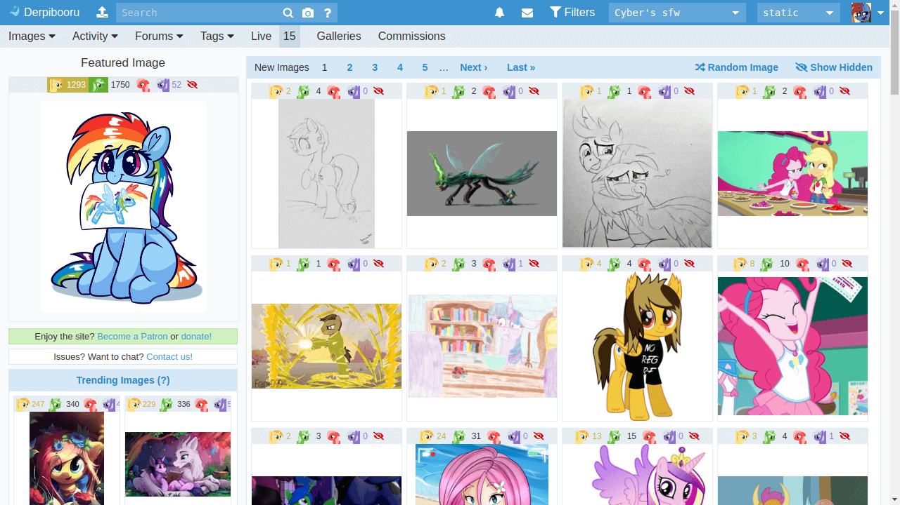

Derpibooru Pony Icons
=====================

Ponifies the favorite/upvote/downvote buttons on [Derpibooru](https://derpibooru.org) (and other Philomena-based pony sites).

## Supported sites
 - Derpibooru
 - Ponybooru
 - Twibooru
 - Ponerpics

## Installation

First, you will need to get a browser extension that supports UserCSS. I recommend [Stylus](https://github.com/openstyles/stylus):
- [Stylus for Google Chrome](https://chrome.google.com/webstore/detail/stylus/clngdbkpkpeebahjckkjfobafhncgmne)
- [Stylus for Firefox](https://addons.mozilla.org/firefox/addon/styl-us/)
- [Stylus for Opera](https://addons.opera.com/extensions/details/stylus/)
- Stylus for Edge - use the Google Chrome version above
- Stylus for Internet Explorer - lol nice try

Then just [click here to install the style](https://styles.cp3.es/derpi-vote-icons.user.css)