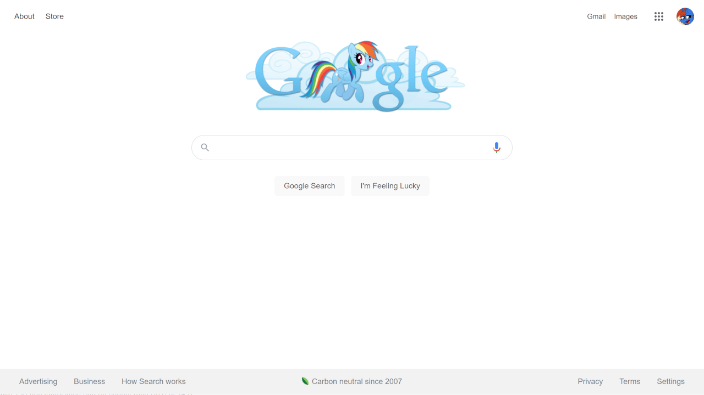

Random Google Ponies
================

A Google theme that replaces the Google logo with a random MLP (My Little Pony) themed version.

You can find the gallery of all the logos used at [googleponies.cyberpon3.net](https://googleponies.cyberpon3.net/) as well as generating a style from a customized list of logos.

Current logos thanks to ssumppg, ThePatrollPL, ViperDash, and Owl-Parchment

## Installation

1. You will need to get a browser extension that supports UserCSS. I recommend [Stylus](https://github.com/openstyles/stylus):
    - [Stylus for Google Chrome](https://chrome.google.com/webstore/detail/stylus/clngdbkpkpeebahjckkjfobafhncgmne)
    - [Stylus for Firefox](https://addons.mozilla.org/firefox/addon/styl-us/)
    - [Stylus for Opera](https://addons.opera.com/extensions/details/stylus/)
    - Stylus for Edge - use the Google Chrome version above

2. Then just [click here to install the style](https://styles.cp3.es/random-google-ponies.user.css)

## Changelog

### Dec. 15, 2021
- Added a toggle option for overriding Google Doodles. Note, this might not always work! Some doodles, especially the interactive ones, make a lot of unique changes to the homepage, and overriding them is not easy.

### Nov. 16, 2021
- Re-wrote the styling to fix issues with Google Doodles.
- Ditched userstyles.org and moved the source code to my self-hosted styles site.
- Set up replication to userstyles.world

### Oct. 5, 2018
- Completely re-wrote the styling because it wasn’t working on some search results pages and things were a bit messy.
- Changed to self-hosted images to speed up image loading
