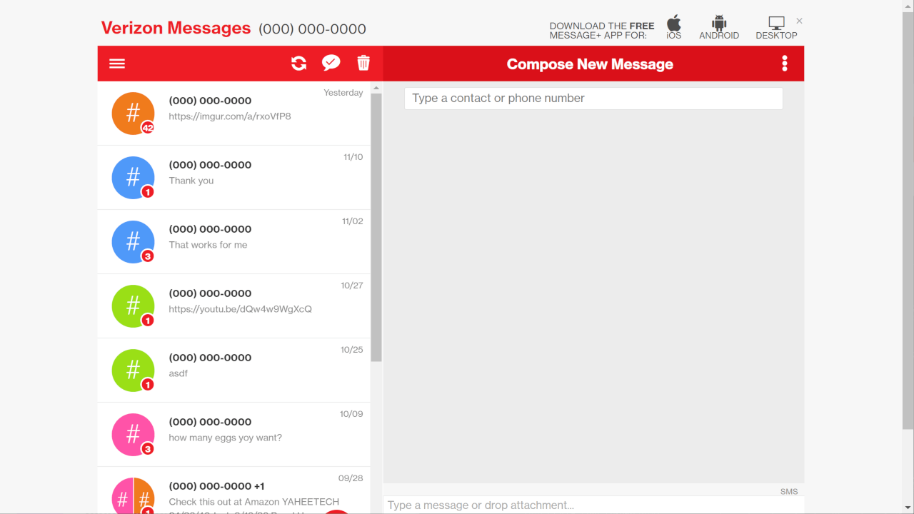
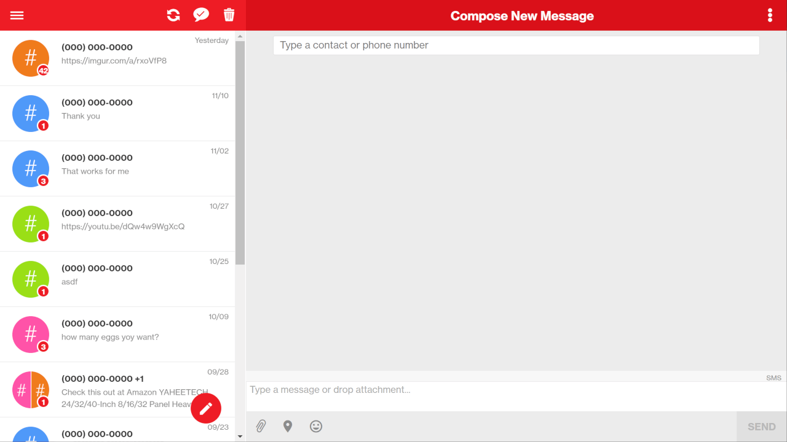

Verizon Web Messages - Real Full-page Mode
==========================================

### Before:

### After:

Fixes the "Full Page Mode" in the Verizon Messages Web App.

## Installation

1. You will need to get a browser extension that supports UserCSS. I recommend [Stylus](https://github.com/openstyles/stylus):
    - [Stylus for Google Chrome](https://chrome.google.com/webstore/detail/stylus/clngdbkpkpeebahjckkjfobafhncgmne)
    - [Stylus for Firefox](https://addons.mozilla.org/firefox/addon/styl-us/)
    - [Stylus for Opera](https://addons.opera.com/extensions/details/stylus/)
    - Stylus for Edge - use the Google Chrome version above

2. Then just [click here to install the style](https://styles.cp3.es/verizon-messages-fullscreen.user.css)
